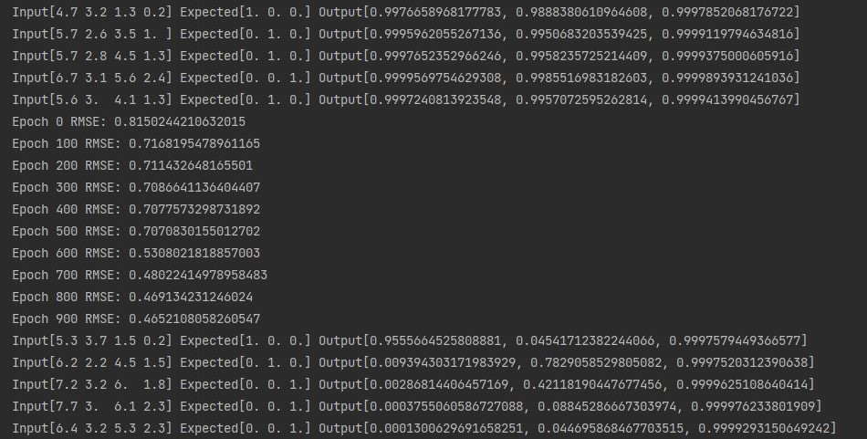
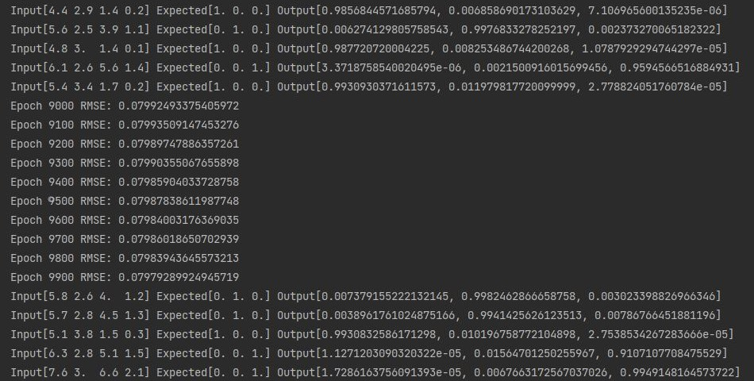
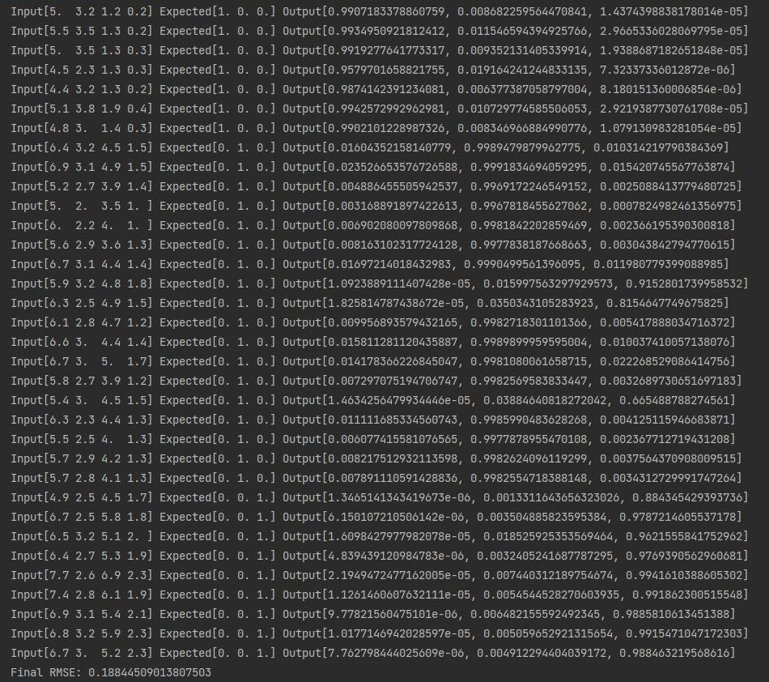

# Neural Network

Feedforward neural network utilizing backpropagation.

Implemented as individual neurodes within a network rather than a matrix approach.

## Neural Network Usage & Functionality

### Setting Up the Data
- *data* = NNData(*features*, *labels*[, *train_factor*=0.9])
  - *features*: features set
  - *labels*: labels set
  - *train_factor*: percentage of data used for training

### Creating the Neural Network

- *network* = FFBPNetwork(*num_inputs*, *num_outputs*)
  - *num_inputs*: number of input layer neurodes
  - *num_outputs*: number of output layer neurodes

### Adding Hidden Layers

- *network*.add_hidden_layer(*num_nodes*[, *position*=0])
  - *num_nodes*: number of neurodes within the hidden layer
  - *position*: position within the neural network to add the hidden layer. A position of 0 adds the hidden layer immediately after the input layer. Each integer increment above 0 moves the hidden layer one layer forward

### Training

- *network*.train(*data_set*[, *epochs*=1000, *verbosity*=2, *order*=NNData.Order.RANDOM])
  - *data_set*: neural network dataset of type NNData
  - *epochs*: number of epochs to run
  - *verbosity*: specifies reporting frequency:
    - 0: no reports made
    - 1: RMSE of most recent epoch reported every 100 epochs
    - 2: RMSE of most recent epoch reported every 100 epochs and print out all input, expected, and output values for every training example every 1000 epochs
  - *order*: NNData.Order.RANDOM for random ordering or NNData.Order.SEQUENTIAL for sequential ordering

### Testing

- *network*.test(*data_set*[, *order*=NNData.Order.SEQUENTIAL])
  - *data_set*: neural network dataset of type NNData
  - *order*: NNData.Order.RANDOM for random ordering or NNData.Order.SEQUENTIAL for sequential ordering

## Getting Started

### Dependencies

- Python version 3.9+
- Required packages listed in requirements.txt.

## Sample Run

Sample run provided in run_iris.py, which trains and tests on the Iris dataset.

Images below showcase segments of the run.

### Initial Training

### End of Training

### Test

